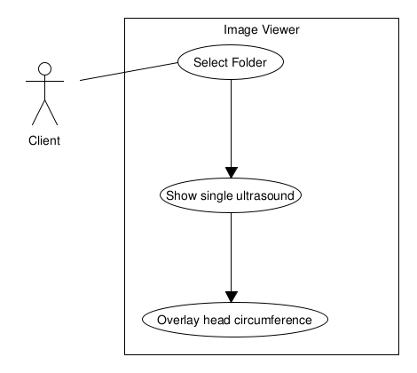

# head-circumference-qt
A graphical user interface to visualize head-circumference, as calculated by the [application](https://github.com/DavidMagezi/head-circumference-embedded). 

# Example behavioural diagram in UML

